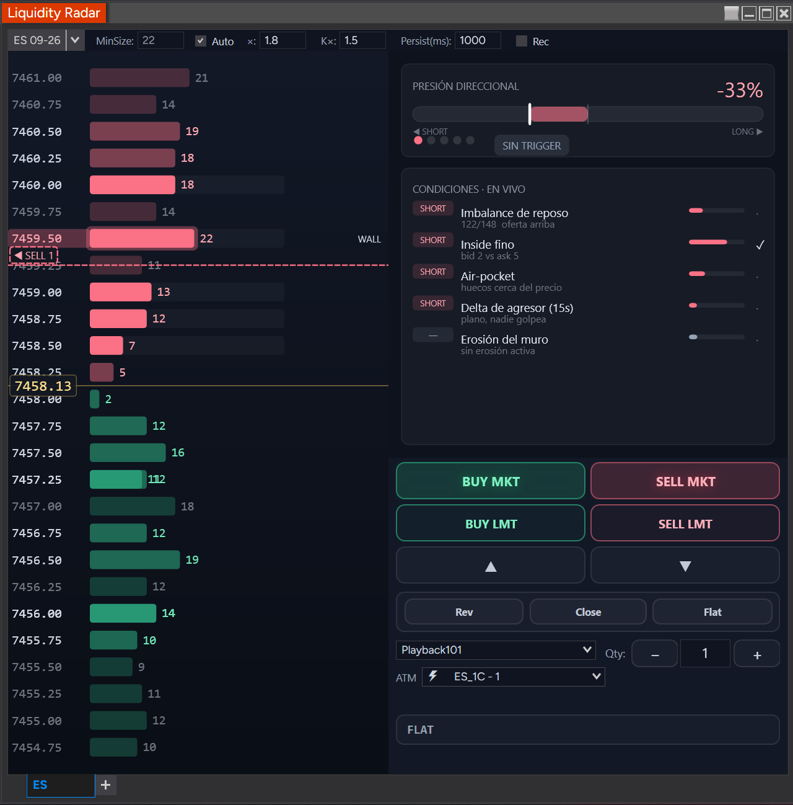
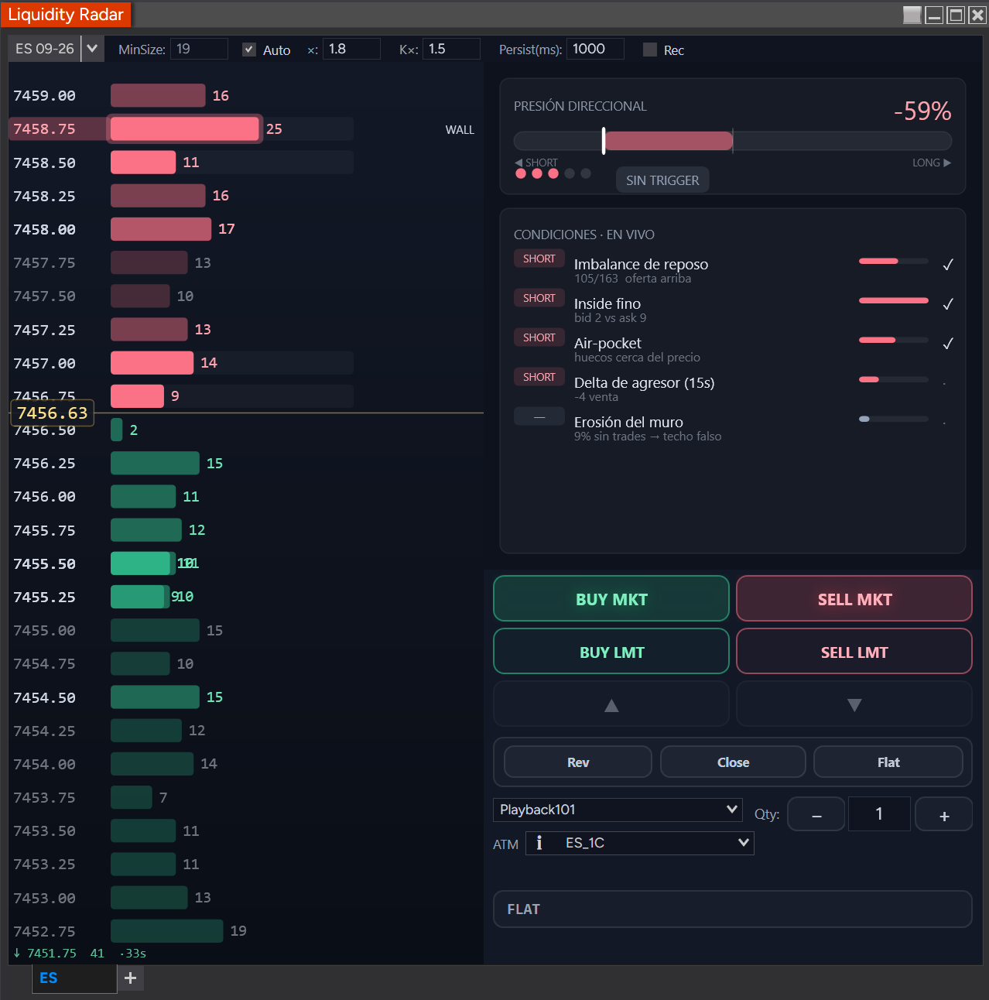

# Liquidity Radar

A standalone **NinjaTrader 8** add-on that reads Level-2 market depth and renders a vertical **"sonar ladder"** of resting liquidity, a **directional-pressure cockpit** built from five order-flow signals, and an integrated **order-entry ticket** — all in one floating window, independent of any chart.

Unlike a plain DOM or heatmap, it **tracks each large order wall as an object with memory**: it remembers walls after they scroll beyond the visible 10 levels, and when price returns it classifies what happened — **Absorbed** (trades hit it, price held, it refilled — iceberg), **Pulled** (size vanished *without* trades — probable spoof), or **Consumed-through** (trades ate it and price broke past). Each read carries a **confidence score that decays while the level is out of view**.

Visual identity: **"Aurora"** — deep-ink background, emerald (bid/support) / coral (ask/resistance), amber inside-market line. Explicitly *not* a Bookmap clone.

<p align="center">
  
</p>
<p align="center"><em>Live on ES 09-26 (Market Replay): the anchored ladder (left), directional-pressure cockpit (top-right), live-conditions panel, and the Chart Trader execution ticket (bottom-right).</em></p>

---

## Status

| Layer | State |
|-------|-------|
| **Engine** (`Engine/`) | ✅ Complete. Pure C#, deterministic, NinjaTrader-free. **46/46 unit tests, 0 warnings.** |
| **NT8 add-on** (`NinjaTrader/`) | ✅ **Built, deployed, and running in Market Replay** (screenshots above). Ladder + cockpit + Chart Trader all live. |
| **Cockpit signal weights** | ⚠️ **Placeholder / being calibrated.** The five signals are computed and displayed live; their blend weights are still being measured against real ES/NQ data (see `docs/measurement-cockpit-signals.md`). Treat the pressure % as a *read*, not a tuned indicator, until calibrated. |
| **Chart Trader → real money** | 🔒 **Sim / Playback only.** Order entry is hard-gated to Simulator/Playback accounts. A real account is blocked unless explicitly armed *and* it has not yet cleared its risk preconditions — **do not trade real money with it yet.** See [Safety](#safety--disclaimer). |

Validation is by unit tests (engine) + `nt8c` compile checks + **Market Replay** behavioral passes — NinjaTrader does not replay Level-2 in the Strategy Analyzer, so there is no historical L2 backtest.

---

## The three panels

### 1 · Sonar ladder (left)

A price-anchored vertical ladder — the price axis is fixed and a sliding amber marker tracks the inside market (the boxed `7458.13` in the overview), so bars don't jump every frame the way a mid-centered view does; the column re-anchors only at the edge (DOM-standard behavior).

- **Bar length + glow = resting size**; the number on each row is the contract count.
- **Color = side/state:** coral for ask/resistance (above the market), emerald for bid/support (below). Desaturated maroon = a level that was **pulled** or has gone stale.
- **`WALL` badge** marks a level that passed all four wall criteria (relative size vs. the median baseline, an absolute floor, persistence, and a flicker guard). In the overview it's the 22-lot ask sitting at 7459.50.
- **Order marker:** a dashed line + gutter tag (`◀ SELL 1`) drawn at your live resting limit order's price — side and quantity — so you can see your order *on the liquidity map*. It moves with the order and disappears when it fills or cancels.
- **Ghost memory band:** walls that scroll beyond the live 10 levels are drawn dimmed with an age tag (`↓ 7451.75  41  ·33s` at the bottom of the cockpit screenshot below = a remembered 41-lot wall, last seen 33 s ago), so the price axis is never blank where the book can't reach.

### 2 · Directional-pressure cockpit (top-right)

A confluence read that fuses five independent order-flow signals into one net bias, a conviction count, and a binary trigger gate.

<p align="center">
  
</p>
<p align="center"><em>The same ES session moments later: short pressure has deepened to −59% with three conditions confirmed (✓) and the <strong>wall-erosion</strong> read now firing ("9% thinned without trades → false ceiling").</em></p>

- **`PRESIÓN DIRECCIONAL` −33% → −59%** — net directional pressure; negative = short lean, positive = long. The tug-of-war bar + needle show the balance between `◀ SHORT` and `LONG ▶`.
- **Conviction dots** — how many of the five signals concur (1/5 in the overview, 3/5 here). Conviction is *not* size: a higher conviction is a stronger read, not a bigger position.
- **`SIN TRIGGER` pill** — the binary gate. It stays "no trigger" until confluence is high enough to light the traffic light (the book signals alone never trigger; a wall/aggressor catalyst is required).
- **`CONDICIONES · EN VIVO`** — the five signals, each with its own bar and a check when it fires:
  1. **Resting imbalance** — bid vs. ask mass at rest (`105/163 offer above`).
  2. **Thin inside** — a lopsided inside market (`bid 2 vs ask 9`).
  3. **Air-pocket** — gaps near price with no cushion.
  4. **Aggressor delta (15 s)** — who's actually hitting the tape (`−4 sell`).
  5. **Wall erosion** — a wall thinning *on approach without trades* — Javier's idea: a false ceiling/floor (`9% thinned without trades → false ceiling`). This is the signal the raw engine's total-vanish classifier can't see; the pressure engine adds the partial read.

### 3 · Chart Trader ticket (bottom-right)

An order-entry surface docked under the cockpit — the radar becomes a place to *act*, not just watch. **Sim/Playback-gated** (see Safety).

- **BUY / SELL MKT** — market orders.
- **BUY / SELL LMT** — **wall-anchored** limits: a SELL LMT rests one tick in front of the largest wall above the market, a BUY LMT one tick in front of the largest wall below (anchored once on submit; falls back to a mid ± 1-tick proxy if there's no wall). The `▲ / ▼` buttons nudge a working limit one tick at a time via order modification (queue priority preserved, no cancel-and-resubmit).
- **Rev / Close / Flat** — reverse, close, or flatten the position (Flat = native cancel-all + close).
- **Account selector** (`Playback101`), **Qty** stepper, and an **ATM selector** (`ES_1C`) — pick an ATM template and MKT/LMT entries attach its bracket (SL/TP); leave it on *None* for a flat entry.
- **Position + PnL bar** — live unrealized P&L in dollars and ticks (`FLAT` when flat).

---

## Why the memory model matters

A radar is blind beyond the 10 visible depth levels. The edge here is that **large walls are detected, remembered with a decaying confidence once they go blind, and re-evaluated on revisit** — turning *"where is the meaningful liquidity, is it still there, and what happened when price hit it"* into a single glance, then folding that into the cockpit's directional read.

---

## Architecture

Two layers. The **engine** is isolated from NinjaTrader so it can be unit-tested with synthetic event sequences; the **NT layer** is the only place threads and the platform API cross.

### Engine (`Engine/` — pure C#, `netstandard2.0`, C# 7.3)

| Class | Responsibility |
|-------|----------------|
| `Primitives` / `RadarConfig` | DTOs (`DepthEvent`, `TradeEvent`, `DepthLevel`, `RadarNode`, `PressureInputs`…) + all tunable parameters |
| `BookMirror` | Positional MBP book + recent-trade ring + aggressor inference + median baselines + aggressor delta |
| `WallDetector` | Median baselines (cross-sectional + temporal) and the 4 wall criteria: relative size, absolute floor, persistence, flicker |
| `EpisodeClassifier` | The three-outcome discriminator (absorbed / pulled / consumed) + partial **erosion** reads |
| `LiquidityMemory` | Confidence: init, decay-while-blind (half-life), revisit updates, eviction, snapshot |
| `WallTracker` | Orchestrator — wires the detectors together and emits an immutable `RadarNode[]` |
| `PressureModel` | The five-signal cockpit: computes net pressure, conviction, and the trigger from `PressureInputs` |

**Determinism:** the engine never reads a wall clock. Time enters only through event timestamps and an explicit `now` parameter — which is what makes it fully unit-testable.

### NT8 layer (`NinjaTrader/`)

`RadarAddOn` (Control-Center menu) → `RadarWindow` + `RadarTabFactory` (floating, workspace-persisted) → `RadarTab` (the threading boundary + engine host) → `RadarVisual` (Aurora ladder) + `CockpitVisual` (pressure panel) + `RadarChartTrader` (order ticket).

```
MarketDepth.Update ┐ (instrument thread, under _engineLock)
MarketData.Update  ┤
                   ▼  map → DTO
      BookMirror → WallTracker.Update(now) → PressureModel.Evaluate
                   ▼  immutable Frame (nodes + book + mid + pressure)
       marshal to UI thread (33 ms paint tick)
                   ▼
   RadarVisual  +  CockpitVisual  +  RadarChartTrader.SetContext
```

`RadarTab` subscribes L2 + trades on the instrument dispatcher, applies each event to the book, runs the engine at ~20 Hz, and swaps an immutable frame that the UI paint tick renders — the instrument thread and UI thread never touch shared engine state without the lock.

---

## Installation (NinjaTrader 8)

**Prerequisites**

- NinjaTrader 8 (Windows).
- A **Level-2 depth feed** — Continuum/CQG, Rithmic, or Tradovate. (Most retail *end-of-day* feeds do not carry L2.)
- For validation: **Market Replay** data downloaded *with depth* (Tools → Historical Data → Market Replay, "Get Data" with the depth option).

**Steps**

1. **Copy the sources** into NinjaTrader's Custom folder — the engine compiles *as source* into NinjaTrader's `Custom` assembly (it is not referenced as an external DLL):
   ```
   Engine\*.cs   ┐
                 ├──►  %USERPROFILE%\Documents\NinjaTrader 8\bin\Custom\AddOns\LiquidityRadar\
   NinjaTrader\*.cs ┘
   ```
   (Copy the `.cs` files themselves into `AddOns\LiquidityRadar\`; the `NinjaTrader\strategy\` sub-folder is a separate optional strategy — leave it out unless you want it.)

2. **Compile:** open NinjaTrader → **NinjaScript Editor → Compile (F5)**. It should build with no errors.

3. **Restart NinjaTrader** — the Control-Center menu entry is registered on startup, so it only appears after the first restart following a successful compile.

4. **Open it:** **Control Center → New → "Liquidity Radar"**. The floating window opens.

5. **Pick an instrument** (e.g. ES or NQ front month) in the selector, and connect a data feed with depth (or a Market Replay connection).

> **Reopen after recompiling.** NinjaTrader does not refresh an *already-open* add-on window when you recompile — close and reopen the Liquidity Radar window after any F5.

---

## Configuration (top bar)

| Control | What it does |
|---------|--------------|
| **Instrument selector** | Which instrument to read (link-aware; persisted in the workspace). |
| **MinSize** | Absolute size floor for a level to be wall-eligible. Dimmed/read-only while **Auto** is on. |
| **Auto** | Auto-calibrate `MinSize` from a smoothed median of live book size (recommended). |
| **×** | The Auto factor — `MinSize ≈ × · median`. Higher = only bigger walls qualify. |
| **K×** | Relative-size multiple over the cross-sectional median for wall detection. |
| **Persist(ms)** | How long a level must hold before it earns the `WALL` badge (flicker guard). |
| **Rec** | Writes a CSV capture (`…\Documents\NinjaTrader 8\LiquidityRadar\`) of node state transitions + per-snapshot pressure inputs, for offline signal calibration. |

Defaults ship tuned for NQ; ES presets and per-instrument calibration are in progress (`docs/calibration-es-day1.md`).

---

## Build & test the engine (contributors)

Requires the .NET SDK (8 or 10). The engine builds and tests **without NinjaTrader**:

```bash
dotnet test          # 46/46 passing, 0 warnings
dotnet build         # netstandard2.0 engine + net8.0 test project
```

To compile-check the full add-on (engine + NT classes) outside the NinjaScript editor, this repo includes a staged-build helper for `nt8c` (a NinjaScript compile CLI) that mirrors the Custom tree:

```bash
bash build/stage-custom.sh
nt8c build --custom-dir build/.stage/Custom      # expect 0 errors
```

> A per-file `nt8c check` reports **false** `CS0246`/`CS0234` for engine types (they only resolve when every file is compiled together as one assembly) — trust the project-wide `nt8c build` above, or the NinjaScript editor's F5.

---

## Documentation

- [`docs/specs/2026-06-28-liquidity-radar-design.md`](docs/specs/2026-06-28-liquidity-radar-design.md) — core design spec (microstructure logic, Aurora tokens, verified NT8 facts).
- [`docs/specs/2026-06-28-liquidity-radar-engine-contract.md`](docs/specs/2026-06-28-liquidity-radar-engine-contract.md) — frozen engine interface contract.
- [`docs/specs/2026-06-29-radar-cockpit-design.md`](docs/specs/2026-06-29-radar-cockpit-design.md) — the directional-pressure cockpit + Chart Trader design.
- [`docs/plans/`](docs/plans) — the six build plans (engine, NT UI, pressure engine, anchored ladder, cockpit render, Chart Trader).
- [`docs/measurement-cockpit-signals.md`](docs/measurement-cockpit-signals.md) — how the cockpit weights are (to be) measured from captured data.
- [`docs/mockups/radar-cockpit-demo.html`](docs/mockups/radar-cockpit-demo.html) — the interactive Aurora mockup the UI was built from.

---

## Roadmap

- [x] Engine — book mirror, wall detection, three-outcome classification, confidence/memory, aggressor delta + erosion — 46/46 unit tests.
- [x] NT8 add-on — anchored ladder, cockpit render, Chart Trader (MKT + wall-anchored LMT + ATM), Market Replay reset handling.
- [ ] **Calibrate the cockpit weights** from captured `Rec` data (replace placeholders with measured values).
- [ ] **Chart Trader → real money:** clear the risk preconditions (server-side stop, qty clamp, confirm-on-live, connection/quote-freshness gate, prop-firm rules) before removing the Sim/Playback gate.
- [ ] Deferred (post-v1): time × price heatmap, alerts, cross-restart memory persistence, multi-instrument.

---

## Safety & disclaimer

- **The Chart Trader is Sim/Playback-only.** Order submission is fail-closed: an account is treated as *real* (and blocked) unless its provider is explicitly Simulator or Playback. A real account additionally requires a per-account **ARM LIVE** toggle — and even then, the documented risk preconditions are **not yet met**, so it must not be used to trade real money.
- This is a market-microstructure **awareness** tool first. Depth feeds are probabilistic about *why* size changes — spoof/iceberg/erosion detection is **inference, not proof**.
- The cockpit's directional pressure uses **uncalibrated placeholder weights** today; do not treat the percentage as a validated signal until it has been measured against real data.
- **Not financial advice.** Trading futures involves substantial risk of loss. You are responsible for anything this tool submits on your behalf.
