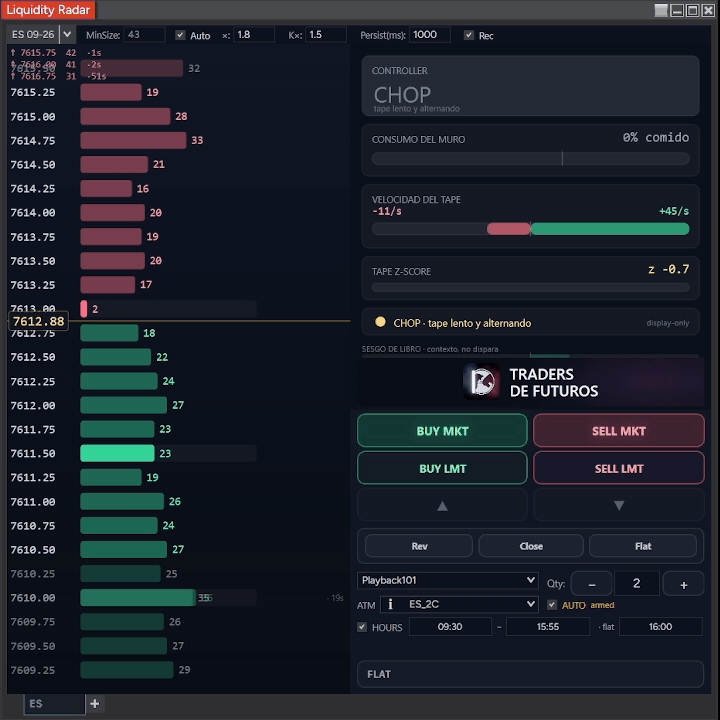
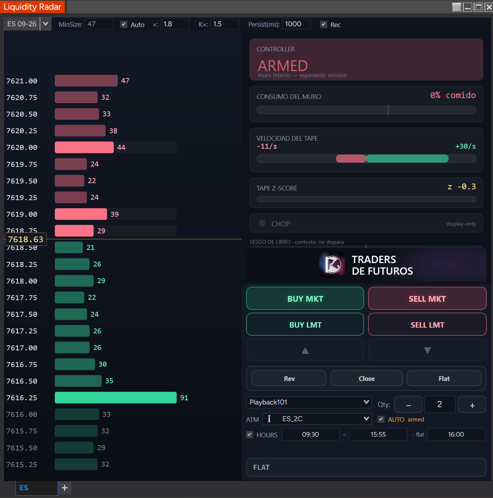
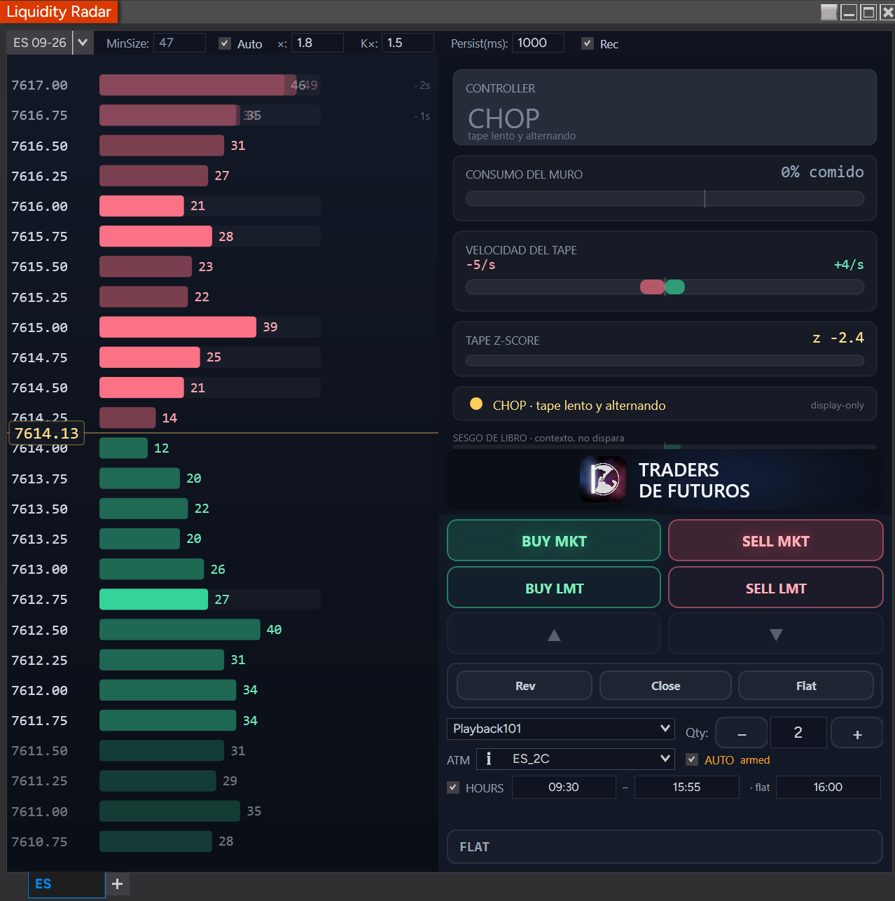
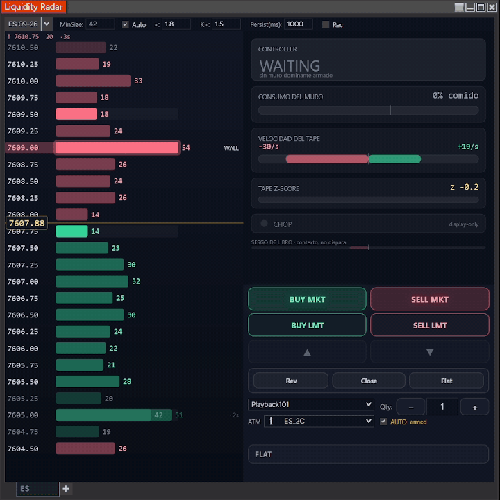

# Liquidity Radar

<p align="center">
  
</p>
<p align="center"><em>The full surface, live on ES (Market Replay): the anchored ladder, the Controller cycling <strong>WAITING → ARMED</strong>, and the Chart Trader ticket with <strong>AUTO</strong> armed and the <strong>HOURS</strong> schedule row (09:30–15:55, flat 16:00).</em></p>

A standalone **NinjaTrader 8** add-on that reads Level-2 market depth and renders a vertical **"sonar ladder"** of resting liquidity, a **Consumption-Break Controller cockpit** — a stateful setup detector built on wall consumption and tape speed — and an integrated **order-entry ticket** with an optional **AUTO fire mode** — all in one floating window, independent of any chart.

Unlike a plain DOM or heatmap, it **tracks each large order wall as an object with memory**: it remembers walls after they scroll beyond the visible 10 levels, and when price returns it classifies what happened — **Absorbed** (trades hit it, price held, it refilled — iceberg), **Pulled** (size vanished *without* trades — probable spoof), or **Consumed-through** (trades ate it and price broke past). Each read carries a **confidence score that decays while the level is out of view**.

Visual identity: **"Aurora"** — deep-ink background, emerald (bid/support) / coral (ask/resistance), amber inside-market line. Explicitly *not* a Bookmap clone.

---

## Status

| Layer | State |
|-------|-------|
| **Engine** (`Engine/`) | ✅ Complete. Pure C#, deterministic, NinjaTrader-free. **111/111 unit tests, 0 warnings.** |
| **NT8 add-on** (`NinjaTrader/`) | ✅ **Built, deployed, and running in Market Replay** (screenshots above). Ladder + Controller cockpit + Chart Trader all live. |
| **Consumption-Break Controller** | ✅ Live (state machine + fire latch + pre-stage). ⚠️ **Thresholds are placeholder / being calibrated** from `Rec` captures on real ES days — eight review/calibration rounds so far (`docs/calibration-consumption-break-es-day1.md`). Treat fires as a *read*, not a tuned signal, until calibrated. |
| **AUTO mode** | ✅ Live, **Sim/Playback only**, hard-gated (ATM required, configurable daily trade cap (default 10, persisted), 15 s auto-cancel, persistent decision log) + **HOURS schedule**: fires only 09:30–15:55, forced flatten at 16:00 (editable in the UI). **Always-armed** (2026-07-03): arming intent + account/ATM/cap/hours persist in the workspace and re-arm automatically when every precondition re-verifies — the daily-cap counter persists too, and a manual Flat clears the intent. **Exit-leg telemetry**: the ATM bracket (SL/TP) is logged at attach, and every closing fill emits `exit` + `trade_summary` rows, so each AUTO trade is gradeable by realized R. |
| **Phase 0 calibration plumbing** | ✅ Shipped per the [ML-calibration ADR](docs/decisions/2026-07-03-ml-calibration-strategy.md): realized-fill telemetry, adaptive `SignificanceBand = max(p85 of live depth, 60)` (spec §5), per-session summary + fires=0 alarm (`lr-sessions.csv`), and a CI test that keeps the AUTO hard gates out of any calibrator's reach. **10-distinct-day capture campaign in progress.** A [multi-day analysis of the corpus so far](docs/2026-07-03-multiday-analysis-adaptation-verdict.md) (8 days, 60 fills) concluded threshold adaptation is **premature** — instrument first, adapt later; the [offline realized-R read](docs/measurement-realized-r-offline.md) grades the existing fires near breakeven net of costs (NO-GO for promotion; primary-build cut PF 1.31 net @1.5t, n=44, knife-edge). |
| **Chart Trader → real money** | 🔒 **Sim / Playback only.** Order entry is hard-gated to Simulator/Playback accounts. A real account is blocked unless explicitly armed *and* it has not yet cleared its risk preconditions — **do not trade real money with it yet.** See [Safety](#safety--disclaimer). |

Validation is by unit tests (engine) + `nt8c` compile checks + **Market Replay** behavioral passes — NinjaTrader does not replay Level-2 in the Strategy Analyzer, so there is no historical L2 backtest.

---

## The three panels

### 1 · Sonar ladder (left)

A price-anchored vertical ladder — the price axis is fixed and a sliding amber marker tracks the inside market (the boxed `7458.13` in the overview), so bars don't jump every frame the way a mid-centered view does; the column re-anchors only at the edge (DOM-standard behavior).

- **Bar length + glow = resting size**; the number on each row is the contract count.
- **Color = side/state:** coral for ask/resistance (above the market), emerald for bid/support (below). Desaturated maroon = a level that was **pulled** or has gone stale.
- **`WALL` badge** marks a level that passed all four wall criteria (relative size vs. the median baseline, an absolute floor, persistence, and a flicker guard). In the overview it's the 22-lot ask sitting at 7459.50.
- **Order marker:** a dashed line + gutter tag (`◀ SELL 1`) drawn at your live resting limit order's price — side and quantity — so you can see your order *on the liquidity map*. It moves with the order and disappears when it fills or cancels.
- **Ghost memory band:** walls that scroll beyond the live 10 levels are drawn dimmed with an age tag (`↓ 7451.75  41  ·33s` at the bottom of the cockpit screenshot below = a remembered 41-lot wall, last seen 33 s ago), so the price axis is never blank where the book can't reach.

### 2 · Consumption-Break Controller cockpit (top-right)

A **stateful setup detector**, not an oscillating meter. The original five-signal weighted-average cockpit flip-flopped long↔short every tick, so it was demoted (spec `2026-07-01`): the primary output is now a **Controller state** that fires **once** on a confirmed change-of-control and latches until reset. The setup mechanized is **Consumption-Break**: a resting wall in price's path gets **eaten toward zero with trades**, and the radar fires right before it snaps through.

<p align="center">
  
</p>
<p align="center"><em>The Controller <strong>ARMED</strong> ("muro intacto — esperando erosión"), waiting for trade-backed consumption. Below: ATM template <code>ES_2C</code>, <strong>AUTO armed</strong>, and the <strong>HOURS</strong> row (fire window 09:30–15:55 · forced flat 16:00).</em></p>

- **`CONTROLLER` state banner** — the state machine: `WAITING → ARMED → COUNTDOWN → FIRE → RESET`, with a global **CHOP** overlay that suppresses all fires. One candidate per side (dominant wall above = short-break candidate, below = long-break); a wall cannot un-consume, so the countdown is structurally incapable of flip-flopping. The banner explains itself in plain language ("sin muro dominante armado", "muro intacto — esperando erosión").
- **`CONSUMO DEL MURO`** — the consumption countdown: how much of the armed wall's peak size has been eaten (`0% comido` → fire threshold), counting only the **trade-backed** fraction of the drop (cancels/pulls don't advance it; a reload resets it).
- **`VELOCIDAD DEL TAPE`** — signed tape velocity (sell/s vs. buy/s bars), from a rolling prints-per-second window.
- **`TAPE Z-SCORE`** — how unusual current tape speed is vs. its EWMA baseline; the fire gate requires acceleration, not just erosion.
- **`CHOP` light** — display + global fire suppressor when the tape is alternating noise:

<p align="center">
  
</p>
<p align="center"><em><strong>CHOP</strong> as a first-class state: slow, alternating tape (z −2.4) — the banner explains it and every fire is suppressed until the tape picks a side.</em></p>

- **`SESGO DE LIBRO · contexto, no dispara`** — the old book-skew signals (imbalance / thin-inside / air-pocket) collapsed into one **vote-less context strip**. It informs, it never triggers.

### 3 · Chart Trader ticket (bottom-right)

An order-entry surface docked under the cockpit — the radar becomes a place to *act*, not just watch. **Sim/Playback-gated** (see Safety).

<p align="center">
  
</p>
<p align="center"><em>A full AUTO trade: the Controller counts down a wall being <strong>eaten by trades</strong>, fires, <strong>AUTO</strong> submits the pre-staged limit — <code>LONG 1 @ 7608.00</code> with the ATM bracket attached — and the target closes it at <strong>+281.25 $ (+22.5 t)</strong>.</em></p>

- **BUY / SELL MKT** — market orders.
- **BUY / SELL LMT** — **wall-anchored** limits: a SELL LMT rests one tick in front of the largest wall above the market, a BUY LMT one tick in front of the largest wall below (anchored once on submit; falls back to a mid ± 1-tick proxy if there's no wall). The `▲ / ▼` buttons nudge a working limit one tick at a time via order modification (queue priority preserved, no cancel-and-resubmit).
- **Rev / Close / Flat** — reverse, close, or flatten the position (Flat = native cancel-all + close).
- **Account selector** (`Playback101`), **Qty** stepper, and an **ATM selector** (`ES_2C`) — pick an ATM template and MKT/LMT entries attach its bracket (SL/TP). **When an ATM is selected, its template governs the position size** (the sum of its bracket quantities — an `ES_2C` enters 2 contracts), exactly as NinjaTrader's own Chart Trader does; the **Qty** stepper then locks to that count and is used only to size a flat, no-ATM entry. Leave the selector on *None* for a flat entry sized by the Qty box.
- **Pre-stage on fire** — when the Controller fires, the ticket pre-stages a **break-direction limit** and lights up **"SETUP LONG/SHORT ready"**; you click BUY/SELL LMT to submit it (click the indicator to discard). The human clicks — unless AUTO is armed:
- **`AUTO` toggle** (below the HOURS row; the **Cap/day** box beside the ATM selector sets the daily trade cap, default 10) — auto-submits the pre-staged break limit **through the same submit path a manual click uses**. Arming is hard-gated: **Sim/Playback account + an ATM template selected**, and it force-disarms (with the reason shown next to the checkbox) on instrument change, account change, ATM back to *None*, or the **daily trade cap**. Your arming intent, account, ATM template, qty, cap, and HOURS settings **persist in the workspace**, and AUTO **re-arms automatically** once every precondition re-verifies after a restore or a for-cause disarm — fail-closed: the daily-cap counter persists across a same-day reopen, the 16:00 flatten stays disarmed for the rest of that day, and a manual **Flat** clears the intent entirely (only a human re-check of the box brings it back). An unfilled auto limit **auto-cancels after 15 s**, and every AUTO decision is appended to a persistent CSV log (`…\Documents\NinjaTrader 8\LiquidityRadar\`) for audit — including, per trade, the **ATM bracket at attach** (`sl/tp` ticks) and **`exit` / `trade_summary` rows** (exit reason, realized ticks, duration) so every AUTO trade is gradeable by realized R.
- **`HOURS` schedule** (under the AUTO row, on by default) — AUTO fires only between **09:30–15:55** (replay/exchange clock), and at **16:00** any open position or working order is **force-flattened** through the same native cancel-all + close path as the Flat button (which also disarms AUTO). All three times are editable in the row; the flatten runs once per replay day and applies even if AUTO was already disarmed (e.g. by the daily cap).
- **Position + PnL bar** — live unrealized P&L in dollars and ticks (`FLAT` when flat).

---

## Why the memory model matters

A radar is blind beyond the 10 visible depth levels. The edge here is that **large walls are detected, remembered with a decaying confidence once they go blind, and re-evaluated on revisit** — turning *"where is the meaningful liquidity, is it still there, and what happened when price hit it"* into a single glance, then folding that into the cockpit's directional read.

---

## Architecture

Two layers. The **engine** is isolated from NinjaTrader so it can be unit-tested with synthetic event sequences; the **NT layer** is the only place threads and the platform API cross.

### Engine (`Engine/` — pure C#, `netstandard2.0`, C# 7.3)

| Class | Responsibility |
|-------|----------------|
| `Primitives` / `RadarConfig` | DTOs (`DepthEvent`, `TradeEvent`, `DepthLevel`, `RadarNode`, `PressureInputs`…) + all tunable parameters |
| `BookMirror` | Positional MBP book + recent-trade ring + aggressor inference + median baselines + aggressor delta |
| `WallDetector` | Median baselines (cross-sectional + temporal) and the 4 wall criteria: relative size, absolute floor, persistence, flicker |
| `EpisodeClassifier` | The three-outcome discriminator (absorbed / pulled / consumed) + partial **erosion** reads |
| `LiquidityMemory` | Confidence: init, decay-while-blind (half-life), revisit updates, eviction, snapshot |
| `WallTracker` | Orchestrator — wires the detectors together and emits an immutable `RadarNode[]` |
| `TapeSpeed` | Rolling prints/sec + buy/sell volume/sec, EWMA baseline + **z-score**, velocity-at-a-price |
| `ConsumptionTracker` | Per dominant wall: peak/current size, the **trade-backed** consumption fraction, reload detection |
| `ControllerStateMachine` | The Consumption-Break spine: per-side candidate states + global CHOP gate + one-shot latched `FireEvent`; z-latch, K-window persistence, pull-veto, blind-trust identity guard |
| `PressureModel` | Demoted to the vote-less **`BookSkewContext`** read (the old five-signal meter collapsed) |

**Determinism:** the engine never reads a wall clock. Time enters only through event timestamps and an explicit `now` parameter — which is what makes it fully unit-testable.

### NT8 layer (`NinjaTrader/`)

`RadarAddOn` (Control-Center menu) → `RadarWindow` + `RadarTabFactory` (floating, workspace-persisted) → `RadarTab` (the threading boundary + engine host) → `RadarVisual` (Aurora ladder) + `CockpitVisual` (pressure panel) + `RadarChartTrader` (order ticket).

```
MarketDepth.Update ┐ (instrument thread, under _engineLock)
MarketData.Update  ┤
                   ▼  map → DTO
      BookMirror → WallTracker.Update(now) → TapeSpeed + ConsumptionTracker
                   ▼                              ▼
        PressureModel (context)      ControllerStateMachine (state + FireEvent)
                   ▼  immutable Frame (nodes + book + mid + controller + tape)
       marshal to UI thread (33 ms paint tick)
                   ▼
   RadarVisual  +  CockpitVisual  +  RadarChartTrader.SetContext (pre-stage / AUTO)
```

`RadarTab` subscribes L2 + trades on the instrument dispatcher, applies each event to the book, runs the engine at ~20 Hz, and swaps an immutable frame that the UI paint tick renders — the instrument thread and UI thread never touch shared engine state without the lock.

---

## Installation (NinjaTrader 8)

**Prerequisites**

- NinjaTrader 8 (Windows).
- A **Level-2 depth feed** — Continuum/CQG, Rithmic, or Tradovate. (Most retail *end-of-day* feeds do not carry L2.)
- For validation: **Market Replay** data downloaded *with depth* (Tools → Historical Data → Market Replay, "Get Data" with the depth option).

**Steps**

1. **Copy the sources** into NinjaTrader's Custom folder — the engine compiles *as source* into NinjaTrader's `Custom` assembly (it is not referenced as an external DLL):
   ```
   Engine\*.cs   ┐
                 ├──►  %USERPROFILE%\Documents\NinjaTrader 8\bin\Custom\AddOns\LiquidityRadar\
   NinjaTrader\*.cs ┘
   ```
   (Copy the `.cs` files themselves into `AddOns\LiquidityRadar\`; the `NinjaTrader\strategy\` sub-folder is a separate optional strategy — leave it out unless you want it.)

2. **Compile:** open NinjaTrader → **NinjaScript Editor → Compile (F5)**. It should build with no errors.

3. **Restart NinjaTrader** — the Control-Center menu entry is registered on startup, so it only appears after the first restart following a successful compile.

4. **Open it:** **Control Center → New → "Liquidity Radar"**. The floating window opens.

5. **Pick an instrument** (e.g. ES or NQ front month) in the selector, and connect a data feed with depth (or a Market Replay connection).

> **Reopen after recompiling.** NinjaTrader does not refresh an *already-open* add-on window when you recompile — close and reopen the Liquidity Radar window after any F5.

---

## Configuration (top bar)

| Control | What it does |
|---------|--------------|
| **Instrument selector** | Which instrument to read (link-aware; persisted in the workspace). |
| **MinSize** | Absolute size floor for a level to be wall-eligible. Dimmed/read-only while **Auto** is on. |
| **Auto** | Auto-calibrate `MinSize` from a smoothed median of live book size (recommended). |
| **×** | The Auto factor — `MinSize ≈ × · median`. Higher = only bigger walls qualify. |
| **K×** | Relative-size multiple over the cross-sectional median for wall detection. |
| **Persist(ms)** | How long a level must hold before it earns the `WALL` badge (flicker guard). |
| **Rec** | Writes CSV captures (`…\Documents\NinjaTrader 8\LiquidityRadar\`): node state transitions + per-snapshot Controller inputs (incl. the `adaptiveSig` depth-percentile band). Unchecking Rec appends a per-session row (arms, fires) to `lr-sessions-<instrument>.csv` (per-instrument, so ES and NQ day-counts don't cross-contaminate) — 3 consecutive arm-but-no-fire sessions raise a report-only alarm. One Rec session per replay day is the capture-campaign protocol (ADR §5). |

Defaults ship tuned for NQ; ES presets and per-instrument calibration are in progress (`docs/calibration-es-day1.md`).

---

## Build & test the engine (contributors)

Requires the .NET SDK (8 or 10). The engine builds and tests **without NinjaTrader**:

```bash
dotnet test          # 111/111 passing, 0 warnings
dotnet build         # netstandard2.0 engine + net8.0 test project
```

To compile-check the full add-on (engine + NT classes) outside the NinjaScript editor, this repo includes a staged-build helper for `nt8c` (a NinjaScript compile CLI) that mirrors the Custom tree:

```bash
bash build/stage-custom.sh
nt8c build --custom-dir build/.stage/Custom      # expect 0 errors
```

> A per-file `nt8c check` reports **false** `CS0246`/`CS0234` for engine types (they only resolve when every file is compiled together as one assembly) — trust the project-wide `nt8c build` above, or the NinjaScript editor's F5.

---

## Documentation

- [`docs/specs/2026-06-28-liquidity-radar-design.md`](docs/specs/2026-06-28-liquidity-radar-design.md) — core design spec (microstructure logic, Aurora tokens, verified NT8 facts).
- [`docs/specs/2026-06-28-liquidity-radar-engine-contract.md`](docs/specs/2026-06-28-liquidity-radar-engine-contract.md) — frozen engine interface contract.
- [`docs/specs/2026-06-29-radar-cockpit-design.md`](docs/specs/2026-06-29-radar-cockpit-design.md) — the (superseded) directional-pressure cockpit + Chart Trader design.
- [`docs/specs/2026-07-01-consumption-break-setup-design.md`](docs/specs/2026-07-01-consumption-break-setup-design.md) — the Consumption-Break setup + Controller spine (supersedes the cockpit's per-tick verdict).
- [`docs/plans/`](docs/plans) — the six build plans (engine, NT UI, pressure engine, anchored ladder, cockpit render, Chart Trader).
- [`docs/measurement-cockpit-signals.md`](docs/measurement-cockpit-signals.md) — how the cockpit weights are (to be) measured from captured data.
- [`docs/calibration-es-day1.md`](docs/calibration-es-day1.md) / [`docs/calibration-consumption-break-es-day1.md`](docs/calibration-consumption-break-es-day1.md) — day-1 ES calibration reports (root causes, config tables, acceptance criteria for the next capture).
- [`docs/decisions/2026-07-03-ml-calibration-strategy.md`](docs/decisions/2026-07-03-ml-calibration-strategy.md) — ADR: how calibration becomes ML-driven (offline counterfactual calibrator, structural anti-collapse, the 10-distinct-day data gate, Phase 0 instrumentation).
- [`docs/2026-07-03-multiday-analysis-adaptation-verdict.md`](docs/2026-07-03-multiday-analysis-adaptation-verdict.md) — multi-day corpus analysis (funnel, gate kills, cross-day drift, fire outcomes) and the verdict that self-adapting thresholds are premature; defines the instrumentation-first next step and the pre-registered adaptation ladder.
- [`docs/measurement-realized-r-offline.md`](docs/measurement-realized-r-offline.md) — offline realized-R read: the AbsorptionScalper bracket replayed over all existing fills + not-armed skips vs a random-entry baseline (near breakeven net of costs; the +3-before-stop race metric is dominated by bracket geometry).
- [`docs/playbook-entries.md`](docs/playbook-entries.md) — the tape-reading playbook the setup was distilled from.
- [`docs/mockups/radar-cockpit-demo.html`](docs/mockups/radar-cockpit-demo.html) — the interactive Aurora mockup the UI was built from.

---

## Roadmap

- [x] Engine — book mirror, wall detection, three-outcome classification, confidence/memory, aggressor delta + erosion — 111/111 unit tests.
- [x] NT8 add-on — anchored ladder, cockpit render, Chart Trader (MKT + wall-anchored LMT + ATM), Market Replay reset handling.
- [x] **Consumption-Break Controller** — tape speed + consumption countdown + state machine + latched fire, rendered in the cockpit.
- [x] **Pre-stage + AUTO mode** — break-direction limit pre-staged on fire; optional hard-gated auto-submit (Sim/Playback) with daily cap, auto-cancel, and a persistent decision log.
- [x] **Instrumentation for realized-R** (2026-07-03) — exit-leg telemetry (ATM bracket at attach, `exit`/`trade_summary` rows), always-armed AUTO persistence (recovers the "not armed at fire time" signal loss — 52% of all skips), and the offline bracket grader (`tools/measure/realized_r_bracket.py`).
- [ ] **Calibrate the Controller thresholds** from captured `Rec` data — now gated on realized-R episodes, per the [multi-day verdict](docs/2026-07-03-multiday-analysis-adaptation-verdict.md): finish the 10-distinct-day campaign with exit legs, then grade gates by outcome (no more hand-tuning rounds).
- [ ] **Chart Trader → real money:** clear the risk preconditions (server-side stop, qty clamp, confirm-on-live, connection/quote-freshness gate, prop-firm rules) before removing the Sim/Playback gate.
- [ ] Deferred (post-v1): time × price heatmap, alerts, cross-restart memory persistence, multi-instrument.

---

## Safety & disclaimer

- **The Chart Trader is Sim/Playback-only.** Order submission is fail-closed: an account is treated as *real* (and blocked) unless its provider is explicitly Simulator or Playback. A real account additionally requires a per-account **ARM LIVE** toggle — and even then, the documented risk preconditions are **not yet met**, so it must not be used to trade real money.
- **AUTO mode never touches a real account.** It can only arm on a Sim/Playback account with an ATM selected, force-disarms whenever any precondition breaks, caps itself at a configurable number of fires/day (default 10; the counter survives a same-day reopen), auto-cancels unfilled limits, and logs every decision to a CSV for audit. Arming intent persists across sessions, but re-arming re-verifies every precondition fail-closed, and a manual Flat kills the intent until a human re-arms.
- This is a market-microstructure **awareness** tool first. Depth feeds are probabilistic about *why* size changes — spoof/iceberg/erosion detection is **inference, not proof**.
- The Controller's thresholds are **uncalibrated placeholders** today (being measured from `Rec` captures); the setup is a **momentum scalp that will take false breaks** — do not treat a fire as a validated signal until calibration lands.
- **Not financial advice.** Trading futures involves substantial risk of loss. You are responsible for anything this tool submits on your behalf.
